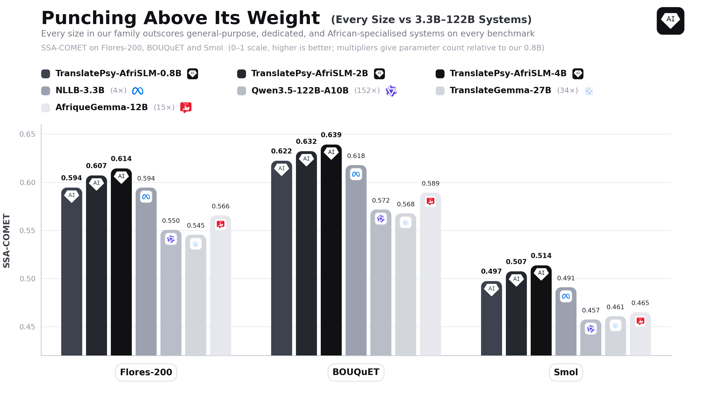

# TranslatePsy-AfriSLM: High-Quality Data Scaling For Low-Resource Machine Translation

This repository contains the code used to recreate the training datasets for the [TranslatePsy-AfriSLM paper](http://arxiv.org/abs/2608.18655) in addition to the models and datasets published on [Hugging Face](https://huggingface.co/collections/qvac/translatepsy-afrislm).



## Data Processing

The following data mixes were featured in the paper (alongside our 'synthetic' and 'open-source' mixes):

- OPUS-100 mix  # training
- General instruct mix  # training
- African instruct mix  # training
- Human mix  # calibration
- AfriNLLB mix  # baseline

The source datasets and models are downloaded from Hugging Face. Python 3.11 or 3.12 is required. Python 3.13 is not currently supported by Unbabel COMET and its NumPy dependency. A separate conda environment is recommended for data processing:

```bash
conda create -n qvac-afri python=3.12 -y
conda activate qvac-afri
python -m pip install --upgrade pip wheel "setuptools<81"
python -m pip install -r requirements.txt
```

## Local directories

No machine-specific paths are embedded in the code. The defaults are:

- `data/raw`: intermediate artifacts, including `raw_opus_100`
- `data/processed`: completed/final mixes
- `data/eval`: evaluation datasets used for MT decontamination

Override them with `--raw-data-dir`, `--output-dir`, and `--eval-data-dir`, or with the `QVAC_RAW_DATA_DIR`, `QVAC_OUTPUT_DIR`, and `QVAC_EVAL_DATA_DIR` environment variables. 

Exact reproduction of the MT mixes requires four evaluation datasets downloaded from their original Hugging Face repositories:

- [facebook/bouquet](https://huggingface.co/datasets/facebook/bouquet)
- [google/smol](https://huggingface.co/datasets/google/smol)
- [facebook/flores](https://huggingface.co/datasets/facebook/flores)
- [google/wmt24pp](https://huggingface.co/datasets/google/wmt24pp)

BOUQUET and FLORES are gated. Before running the preparation step, open both repository pages, accept their access conditions, and authenticate locally with your Hugging Face account:

```bash
hf auth login
```

Then download and convert all four datasets into the common wide `sentence_<language>_<script>` format with the following command:

```bash
python processing.py eval --eval-data-dir data/eval
```

The source revisions and the exact SMOL/WMT24++ configurations are pinned in `processing.py`. Only the required pairwise configurations are downloaded; the script does not clone the complete SMOL repository. Hugging Face caches downloads, so interrupted or repeated runs reuse local files. Set `HF_HOME` if the default cache location does not have enough space.

The generated Hugging Face `save_to_disk` layout is:

```text
data/eval/
├── eval_smol/
├── eval_flores_200/
├── eval_wmt24pp/
└── eval_bouquet/
```

The prepared schemas match the evaluation artifacts used by this project:

- BOUQUET: `dev` (504 rows) and `test` (854), 275 sentence columns
- SMOL: `dev` (862 rows), 30 sentence columns
- FLORES-200: `dev` (997) and `devtest` (1,012), 204 sentence columns
- WMT24++: `test` (960 rows after bad-source filtering), 53 sentence columns

The script fails clearly if any are absent instead of silently producing a different dataset. Existing prepared directories are skipped, making the preparation command safe to resume.

## Usage

Show all options:

```bash
python processing.py --help
```

Build OPUS-100. The raw scoring stage must run before the final stage:

```bash
python processing.py opus-raw opus
```

The OPUS raw stage is designed for one node with eight visible GPUs. Run it directly with Python; `processing.py` spawns one COMET worker per GPU, so neither `torchrun` nor a separate Bash launcher is required:

```bash
CUDA_VISIBLE_DEVICES=0,1,2,3,4,5,6,7 python processing.py opus-raw opus
```

A Bash or scheduler script is optional and only needed to request the 8-GPU node, activate an environment, or configure logs. The default `--comet-gpus 8` matches this setup; lower `--comet-batch-size` if GPU memory is insufficient.

Build either instruction mix:

```bash
python processing.py instruct
python processing.py afri-instruct
```

Build the African MT mixes:

```bash
python processing.py human afri-nllb
```

Build every dataset:

```bash
python processing.py all
```

Example with custom local directories:

```bash
python processing.py all \
  --raw-data-dir /path/to/intermediate \
  --output-dir /path/to/output \
  --eval-data-dir /path/to/eval
```

For the closest reproduction, keep the default tokenizer and random seed and use the pinned evaluation revisions.


## Model Inference

`chat.py` provides two inference modes on one CUDA GPU. Both use the model's chat template with sampling enabled at temperature 0.3.

Qwen3.5 requires Transformers 5, while the COMET dependency used for dataset processing requires Transformers 4. Use a separate inference environment to avoid incompatible dependencies:

```bash
conda create -n qvac-afri-chat python=3.12 -y
conda activate qvac-afri-chat
python -m pip install -r requirements-chat.txt
```

### Conversational mode

Conversational mode is the default. It uses a simple system prompt and retains the complete multi-turn history:

```bash
CUDA_VISIBLE_DEVICES=0 python chat.py
```

Default inference settings:

- Model: `qvac/TranslatePsy-AfriSLM-2B` (2B parameters)
- Device: one CUDA GPU, with model dtype selected automatically
- Decoding: sampling with temperature 0.3
- Maximum response length: 256 new tokens
- Prompt formatting: the model tokenizer's chat template

Run `python chat.py --help` for the complete, up-to-date CLI argument list. Enter `/reset` to clear the conversation and `/exit` to quit. You can also provide another Hugging Face model ID or a local checkpoint:

```bash
CUDA_VISIBLE_DEVICES=0 python chat.py \
  --model <PATH_TO_CHECKPOINT>
```

### Strict translation mode

Provide all three translation arguments to reproduce the single-turn prompt format used in the paper experiments. The model translates once, prints the result, and exits (strictly for reproducibility):

```bash
CUDA_VISIBLE_DEVICES=0 python chat.py \
  --source_lang English \
  --target_lang Swahili \
  --source_text "How are you today?"
```

`--source_lang`, `--target_lang`, and `--source_text` must always be supplied together. Strict mode can also be combined with `--model` for custom checkpoints.

### GGUF inference with llama.cpp

Q4_K_M and Q8_0 GGUF quantizations are available for every model size:

- **0.8B:** [Q4_K_M](https://huggingface.co/qvac/TranslatePsy-AfriSLM-0.8B-Q4-GGUF) · [Q8_0](https://huggingface.co/qvac/TranslatePsy-AfriSLM-0.8B-Q8-GGUF)
- **2B:** [Q4_K_M](https://huggingface.co/qvac/TranslatePsy-AfriSLM-2B-Q4-GGUF) · [Q8_0](https://huggingface.co/qvac/TranslatePsy-AfriSLM-2B-Q8-GGUF)
- **4B:** [Q4_K_M](https://huggingface.co/qvac/TranslatePsy-AfriSLM-4B-Q4-GGUF) · [Q8_0](https://huggingface.co/qvac/TranslatePsy-AfriSLM-4B-Q8-GGUF)

Install [llama.cpp](https://github.com/ggml-org/llama.cpp) and the Hugging Face CLI, then download the desired GGUF. For example:

```bash
python -m pip install --upgrade huggingface_hub

hf download qvac/TranslatePsy-AfriSLM-2B-Q4-GGUF \
  TranslatePsy-AfriSLM-2B-Q4_K_M-imat.gguf \
  --local-dir .
```

Start a multi-turn conversation using the chat template embedded in the GGUF:

```bash
llama-cli \
  --model TranslatePsy-AfriSLM-2B-Q4_K_M-imat.gguf \
  --ctx-size 2048 \
  --conversation
```

Add `--n-gpu-layers 99` to offload all possible layers to a supported GPU. Substitute any of the repository and file names linked above to run another model size or quantization.

## Citation

If you use our TranslatePsy-AfriSLM dataset/models in your research, please cite the following paper:

```bibtex
@misc{gritta2026translatepsyafrislmhighqualitydatascaling,
      title={TranslatePsy-AfriSLM: High-Quality Data Scaling For Low-Resource Machine Translation}, 
      author={Milan Gritta and Patrik Lambert and Jihye Back and Amril Nazir},
      year={2026},
      eprint={2608.18655},
      archivePrefix={arXiv},
      primaryClass={cs.CL},
      url={https://arxiv.org/abs/2608.18655}, 
}
```